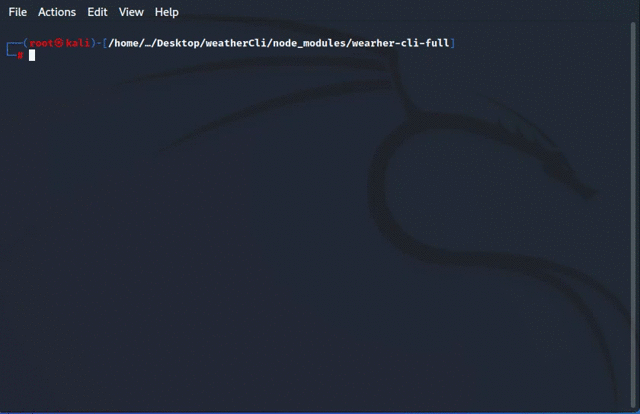

  <h1>🌧 Weather CLI ⛅</h1>

  
  
Приложение создано на платформе Node.js + Axios

 

    <h2>Чтобы начать пользоваться приложением необходимо:</h2>
    <ul>
        <li>Иметь установленную платформу <code>Node.js</code> и пакетный менеджер <code>npm</code></li>
        <li>Создать папку для проекта и инициализировать проект - <code>npm init -y</code> ( <code>-y</code> скип параметров)</li>
        <li>Установить пакет npm <a href="https://www.npmjs.com/package/wearher-cli-full">КЛИК</a></li>
        <li>После установки пакета перейти в директорию <code>./node_modules/wearher-cli-full</code></li>
        <li>Чтобы запустить приложение - нужно ввести в терминал/консоль <code>node weather.js</code></li>
    </ul>

 

    <h2>Управление приложением:</h2>
      <ul>
        <li>
          В начале следует ввести токен доступа к api <code>node weather.js -t 2adbeac2d536b2ed4754816ad7feb160</code> (токен сгенерирован автоматически)
        </li>
        <li>
          Далее следует ввести город в котором требуется узнать погоду <code>node weather.js -s moscow </code> (город вводится со строчной буквы)
        </li>
        <li>
          Для запуска CLI необходимо ввести <code>node weather.js</code>
        </li>
      </ul>

 
        

            
            
            
        

